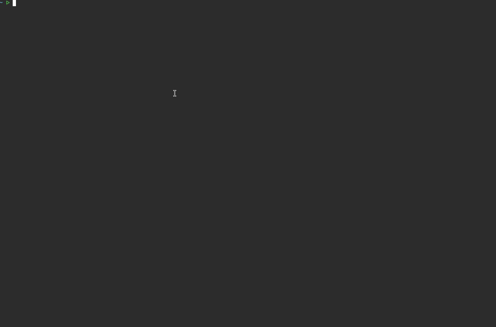

<p align="center">
    <b>PassTheCert-rs</b>
</p>

<p align="center">
    
    
    
    
    <a href="https://github.com/g0h4n/RustHound-CE/issues/31"></a>
</p>

<hr />

**PassTheCert-rs** is a cross-platform, pure-Rust implementation of the [PassTheCert](https://github.com/AlmondOffSec/PassTheCert) technique: it authenticates to an LDAP/S server with a **client certificate** through Schannel, and performs a set of LDAP attack actions over that certificate-authenticated session, no password, no NT hash, no PKINIT.

It was built to prototype Pass-the-Certificate support for [RustHound-CE](https://github.com/g0h4n/RustHound-CE) ([issue #31](https://github.com/g0h4n/RustHound-CE/issues/31)), and uses the same TLS stack (`ldap3` + `rustls`). The Kerberos-less certificate authentication is useful when a Domain Controller does not support PKINIT (e.g. its certificate lacks the Smart Card Logon EKU) but LDAP over Schannel is available. Because authentication happens through Schannel, it also works where LDAP Channel Binding is enforced.

- [HELP.md](HELP.md) - How to compile it? How to use it? All actions with examples.
- [ROADMAP.md](ROADMAP.md) - Implemented actions and planned evolutions.
- [CONTRIBUTING.md](CONTRIBUTING.md) - How to contribute to the project.

# Quick usage

## Compilation

```bash
# Build a release binary
cargo build --release
# Binary: ./target/release/passthecert-rs
```

## Getting a certificate

Use [Certipy](https://github.com/ly4k/Certipy) to obtain a certificate, then extract the PEM cert and key:

```bash
certipy req -u user@domain.local -p 'password' -target ca.domain.local -ca 'DOMAIN-CA' -template User
certipy cert -pfx user.pfx -nokey -out user.crt
certipy cert -pfx user.pfx -nocert -out user.key
```

The certificate must carry the target account's **SID** (Certipy includes it by default) for strong certificate mapping (KB5014754).

## Usage

```bash
# Confirm the mapped identity (Schannel whoami)
passthecert-rs -d DOMAIN.LOCAL -f DC01.DOMAIN.LOCAL --crt user.crt --key user.key --ldaps --action whoami
# Getting ldapshell
passthecert-rs -d DOMAIN.LOCAL -f DC01.DOMAIN.LOCAL --crt user.crt --key user.key --ldaps --action ldapshell

```

Two transports are supported: **LDAPS on 636** (`--ldaps`, implicit Schannel mapping) and **StartTLS on 389** (default, SASL EXTERNAL). Some Domain Controllers accept only one of the two, see [HELP.md](HELP.md).

More examples and the full list of actions are on the [help page](HELP.md).

## Demo

<p align="center">
    <picture>
        
    </picture>
</p>

# Actions

# Actions

| Action | Description |
|---|---|
| `whoami` | Confirm the mapped identity (RFC 4532). |
| `ldapshell` | Interactive LDAP shell exposing every action (search, elevate, RBCD, add_computer, shadow credentials, …). |
| `add_computer` / `del_computer` | Create or delete a machine account. |
| `modify_user` | Reset a user's password, or `--elevate` to grant DCSync. |
| `add_member` / `remove_member` | Add or remove a group member. |
| `enable_account` / `disable_account` | Toggle the account's ACCOUNTDISABLE flag. |
| `read_rbcd` / `write_rbcd` / `remove_rbcd` / `flush_rbcd` | Manage Resource-Based Constrained Delegation. |
| `add_shadow_cred` / `list_shadow_cred` / `remove_shadow_cred` / `flush_shadow_cred` | Manage Shadow Credentials (Key Trust) via `msDS-KeyCredentialLink`; `add` saves a cert+key for PKINIT. |
| `rusthound_ce` | Run a full RustHound-CE (BloodHound-CE) collection over the certificate session, into the current directory, zipped. |

See [HELP.md](HELP.md) for a full table with example commands.

# Disclaimer

This is offensive security tooling. Use it only against systems you are explicitly authorized to test.

# Credits

This tool ports the technique and action set of [AlmondOffSec/PassTheCert](https://github.com/AlmondOffSec/PassTheCert) (by drm / [@lowercase_drm](https://github.com/ThePirateWhoSmellsOfSunflowers)) to Rust. Original research: [Almond blog post](https://offsec.almond.consulting/authenticating-with-certificates-when-pkinit-is-not-supported.html). Certificate handling relies on [Certipy](https://github.com/ly4k/Certipy) by Oliver Lyak.